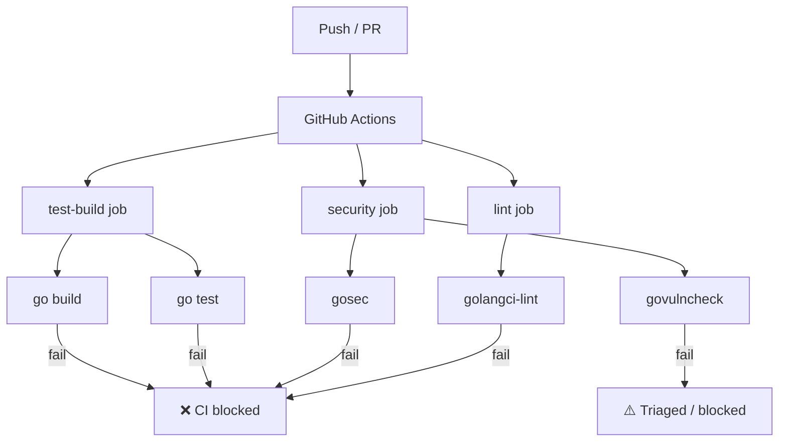

# CI Hardening — Design

## Architecture Overview



3 jobs paralelos. Se qualquer um falhar, CI falha. `govulncheck` pode ser triado como warning se não houver fix disponível.

## Code Reuse Analysis

| O que existe | O que usamos |
|-------------|--------------|
| `.golangci.yml` | Expandir com linters adicionais |
| `.github/workflows/ci.yml` | Adicionar jobs `lint` e `security` |
| `Makefile` | Adicionar targets `lint`, `sec`, `check` |
| Nada de `gosec` ou `govulncheck` | Adicionar do zero |

## Component Definitions

### 1. `.golangci.yml` — Linter Configuration

**Linters a adicionar** (além do `staticcheck` já existente):

| Linter | Propósito | Severidade |
|--------|-----------|------------|
| `errcheck` | Checks for unchecked errors | error |
| `govet` | Go's built-in suspicious constructs | error |
| `ineffassign` | Ineffective assignments | error |
| `unused` | Unused code (replaces deadcode + structcheck + varcheck) | error |
| `misspell` | Spelling mistakes in strings | warning |
| `goconst` | Repeated string literals → constants | warning |
| `gocritic` | Opinionated Go style checks | warning |
| `staticcheck` | Already configured (all checks, -SA5011, -ST1000) | error |

**Configuração**:
```yaml
version: "2"
linters:
  enable:
    - errcheck
    - govet
    - ineffassign
    - unused
    - misspell
    - goconst
    - gocritic
    - staticcheck
  settings:
    staticcheck:
      checks:
        - "all"
        - "-SA5011"  # false positive: t.Fatal
        - "-ST1000"  # package comments
    goconst:
      min-len: 3
      min-occurrences: 3
    gocritic:
      enabled-checks:
        - appendAssign
        - argOrder
        - badCall
        - badCond
        - captLocal
        - caseOrder
        - codegenComment
        - commentFormatting
        - defaultCaseOrder
        - deprecatedComment
        - dupArg
        - dupBranchBody
        - dupCase
        - dupSubExpr
        - elseif
        - emptyFallthrough
        - evalOrder
        - exitAfterDefer
        - flagDeref
        - flagName
        - ifElseChain
        - importShadow
        - indexAlloc
        - mapKey
        - nilValReturn
        - offBy1
        - rangeExprCopy
        - regexpMust
        - sloppyLen
        - stringXbytes
        - switchTrue
        - typeAssertChain
        - typeSwitchVar
        - underef
        - unlabelStmt
        - unlambda
        - unnecessaryBlock
        - unslice
        - valSwap
        - weakCond
        - wrapperFunc
        - yodaStyleExpr
  exclusions:
    - path: _test\.go
      linters:
        - errcheck
        - goconst
        - unused
    - path: internal/bridge/bundle\.go
      linters:
        - all
```

### 2. `.github/workflows/ci.yml` — CI Pipeline

3 jobs paralelos:

```yaml
jobs:
  lint:
    runs-on: ubuntu-latest
    steps:
      - uses: actions/checkout@v6
      - uses: actions/setup-go@v6
        with: { go-version: '1.26.3' }
      - uses: golangci/golangci-lint-action@v7
        with:
          version: latest
          args: --timeout=5m

  security:
    runs-on: ubuntu-latest
    steps:
      - uses: actions/checkout@v6
      - uses: actions/setup-go@v6
        with: { go-version: '1.26.3' }
      - name: gosec
        uses: securecodewarrior/github-action-gosec@master
        with:
          args: -no-fail -fmt sarif -out gosec-results.sarif ./...
      - name: govulncheck
        run: go run golang.org/x/vuln/cmd/govulncheck@latest ./...

  test-build:
    # ... existing job, unchanged
```

### 3. `Makefile` — Local Targets

```makefile
.PHONY: lint sec check

lint:
	golangci-lint run --timeout=3m ./...

sec:
	gosec -no-fail -fmt sarif -out gosec-results.sarif ./...
	go run golang.org/x/vuln/cmd/govulncheck@latest ./...

# Full local gate — same checks as CI
check: lint sec test vet
	@echo "✅ All checks passed"
```

## Error Handling

- **`golangci-lint` não instalado**: `make lint` falha com mensagem "golangci-lint not found. Install: brew install golangci-lint"
- **`gosec` não instalado**: `make sec` falha com mensagem similar
- **CI timeout**: golangci-lint com `--timeout=5m`, gosec com timeout padrão do action
- **Falso positivo**: comentário `//nolint:<linter>` com justificativa documentada

## Tech Decisions

| Decisão | Escolha | Justificativa |
|---------|---------|---------------|
| Linter runner | `golangci-lint` | Padrão da indústria Go, roda múltiplos linters em paralelo |
| Versão no CI | `latest` via action | Sempre atualizado, não precisa manter versão manualmente |
| Security scanner | `gosec` | Focado em segurança Go, mantido pela comunidade |
| Vulnerability scanner | `govulncheck` | Oficial do Go team, usa database de CVEs |
| CI platform | GitHub Actions | Já configurado, sem custo adicional |
| Local install | `brew` (macOS) / `go install` (Linux) | Consistente com o resto do toolchain |
| Job paralelismo | 3 jobs paralelos | Maximiza velocidade, cada job ~1-2 min |
| gosec output | SARIF | Integrável com GitHub Security tab |

## Baseline Esperada

Após implementação, o código atual deve passar em todos os gates. Se houver findings, são bugs reais que precisam ser corrigidos ou false positives a documentar com `//nolint`.
