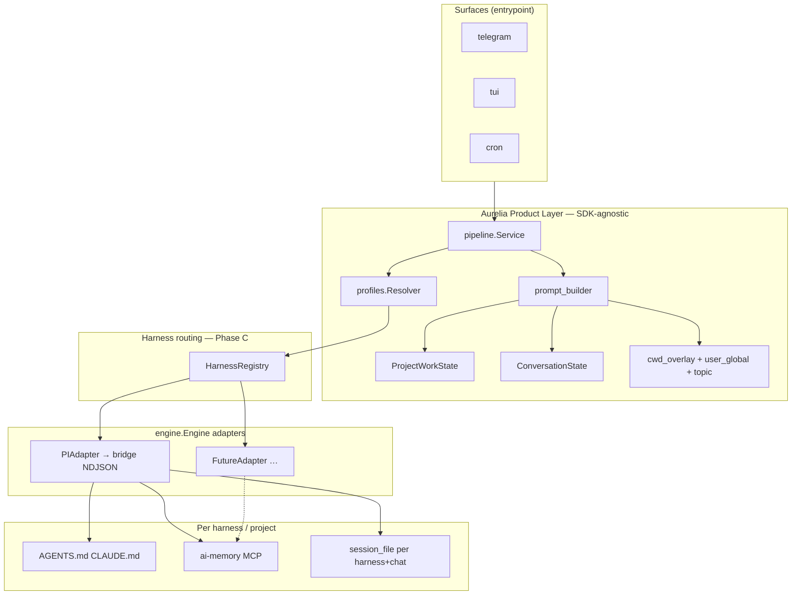

# Multi-SDK — Design

**Spec:** `.specs/features/multi-sdk/spec.md`

---

## Stack diagram (estado-alvo Phase C)



---

## Dimensões ortogonais

| Dimensão | Campo | Valores | Quem define |
|---|---|---|---|
| **Superfície UX** | `entrypoint` | `telegram`, `tui`, `cron` | transport wiring |
| **Motor** | `harness` | `pi`, … | `PromptProfile.Harness` ou default app |
| **Projeto** | `cwd` / `projectSlug` | path → slug | `/cwd`, binding, profile |
| **Conversa** | `chatID`, `threadID` | int | Telegram/TUI session |

`entrypoint` e `harness` são **independentes**: TUI + `harness: pi` é o caso comum pós-Phase A.

---

## `internal/engine` (Phase B)

Ver `.specs/features/bridge-adapter-interface/design.md` para tipos e mapeamento PI.

Adição para multi-SDK:

```go
// engine.go — metadata no Request (já previsto)
type Request struct {
    // ...
    Metadata map[string]string
}

// Convenções Metadata (Phase C):
//   "harness"     → nome do adapter usado
//   "entrypoint"  → telegram|tui|cron
//   "profile"     → effective prompt profile name
```

`SystemPrompt` é sempre pré-montado pelo pipeline — adapters não chamam `buildSystemPrompt`.

---

## `HarnessRegistry` (Phase C)

**Package:** `internal/engine/registry.go` (ou `internal/harness/registry.go` — preferir colocar junto de `engine`).

```go
type Registry struct {
    defaultName string
    engines     map[string]engine.Engine
}

func NewRegistry(defaultHarness string) *Registry

func (r *Registry) Register(name string, eng engine.Engine) error // duplicate → error

func (r *Registry) Resolve(name string) (engine.Engine, error)
// empty name → default; unknown → error (fail-closed)
```

**Wiring** (`cmd/aurelia/app.go`):

```go
reg := engine.NewRegistry("pi")
reg.Register("pi", bridge.NewPIAdapter(bridgeInstance))
pipeCfg.EngineRegistry = reg
```

**Pipeline** (`buildBridgeRequest` → `buildEngineRequest`):

```go
harness := "pi"
if profile != nil && profile.Harness != "" {
    harness = profile.Harness
}
eng, err := s.registry.Resolve(harness)
if err != nil {
    return userFacingHarnessError(harness)
}
```

---

## Session store com harness (Phase C)

**Ficheiro:** `internal/session/store.go`

Chave actual implícita: `(chatID, threadID, userID)`.

Extensão:

```go
type SessionKey struct {
    ChatID   int64
    ThreadID int
    UserID   int64
    Harness  string // default "pi" for backward compat
}
```

- Persistência: acrescentar coluna `harness` ou compor na chave JSON em `sessions.json`.
- Migração: sessões existentes = `harness: "pi"`.
- `GetSession` / `SetSession` recebem harness do profile efectivo.

**Regra:** mudar só `@profile` com mesmo harness → resume sessão. Mudar harness → nova sessão (cold), mas `ProjectWorkState` fornece continuidade.

---

## Runlog extensions (Phase A + C)

| Campo | Fase | Exemplo |
|---|---|---|
| `entrypoint` | A | `tui` (fix hardcode telegram) |
| `harness` | C | `pi` |

`aurelia debug last` mostra ambos.

---

## Prompt assembly (invariável)

Ordem actual em `prompt_builder.go` — actualizar após Phase A:

```text
1. Runtime Identity (+ harness name when Phase C)
2. Effective Prompt Profile
3. Persona
4. Cron instructions (if applicable)
5. Surface instructions (entrypoint — Phase A)
6. Security boundaries
7. Project Work State OR Conversation Continuity
8. Last run checkpoint (conditional)
9. Persistent memory + ai-memory routing hint
10. Long-task / codebase-read heuristics
```

Secção ai-memory (Phase A, linha única em memory block):

> Decisões duráveis e handoffs formais: ai-memory MCP (via harness). Trabalho activo: Project Work State acima.

---

## ai-memory por harness

### Hoje (PI)

- Extension `~/.pi/agent/extensions/ai-memory.ts`
- Hook `before_agent_start` → handoff
- Tools `mcp` → `memory_query`, etc.

### Futuro (adapter não-PI)

Opções (decidir na Phase D):

| Opção | Prós | Contras |
|---|---|---|
| **A. Sidecar PI** | Reutiliza MCP/tools sem reimplementar | Dependência Node mesmo com outro LLM |
| **B. MCP nativo no adapter** | Limpo por harness | Cada adapter implementa transport |
| **C. HTTP directo** | Aurelia CLI thin client | Viola “não gateway wiki” se no daemon |

**Recomendação Phase D:** Opção B para harness principal; Opção A aceitável para protótipo.

Aurelia **nunca** chama ai-memory HTTP no hot path do pipeline — só o modelo via tools do harness.

---

## Segundo harness — critérios de selecção (Phase D, TBD)

Candidato deve:

1. Implementar `engine.Engine` com `Query`/`Command`/`Stats`
2. Aceitar `SystemPrompt` pré-montado
3. Expor ou permitir ai-memory MCP
4. Suportar `cwd` + tools com policy intersect
5. Ter story de teste: mesmo `ProjectWorkState` visível após switch de harness

Candidatos a discutir com Igor: API Anthropic directa, Codex CLI wrapper, OpenCode adapter, stub `mock` para CI.

---

## Testing matrix (Phase C mínimo)

| Cenário | Assert |
|---|---|
| default harness | `pi` adapter invoked |
| `harness: pi` explícito | igual |
| `harness: noop` (test only) | MockEngine, prompt inalterado |
| unknown harness | erro local, runlog não inicia bridge |
| harness switch same cwd | ProjectWorkState injectado; session cold no novo harness |
| entrypoint tui | sem telegram react no prompt |

---

## Anti-patterns (rejeitados)

- Pipeline importar `internal/bridge` para execução (Phase B corrige)
- `dotcontext` harness entre Aurelia e PI
- Wiki writes no Go daemon
- Unificar sessão cross-harness sem `ProjectWorkState`
- `harness` silently fallback quando profile pede valor unsupported