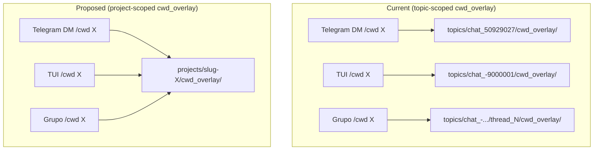

# Project-Scoped CWD Overlay — Design

**Spec:** `.specs/features/project-scoped-memory/spec.md`
**Status:** ✅ Validated

---

## Architecture Overview



---

## Component Changes

### 1. `internal/runtime/resolver.go` — Novo método

Adicionar `ProjectCwdOverlayDir`:

```go
// ProjectCwdOverlayDir returns the project-scoped CWD overlay memory directory:
// ~/.aurelia/projects/<sanitized-cwd>/cwd_overlay/
//
// Unlike TopicCwdOverlayDir, this path is independent of chat/thread — all
// conversations with the same /cwd share the same cwd_overlay memory.
//
// Returns empty string when cwd is empty.
func (r *PathResolver) ProjectCwdOverlayDir(cwd string) string {
    if strings.TrimSpace(cwd) == "" {
        return ""
    }
    return filepath.Join(r.root, "projects", ProjectSlug(cwd), "cwd_overlay")
}
```

`TopicCwdOverlayDir` é mantido para compatibilidade de API mas não será mais usado internamente após a migração. Adicionar docstring de deprecação.

### 2. `internal/dream/memory_writer.go` — Escrita do nudge

**Arquivo:** `internal/dream/memory_writer.go:76-91`

**Mudança:** em `resolveLayerTarget`, o case `"cwd_overlay"` passa a usar `ProjectCwdOverlayDir(cwd)` em vez de `TopicCwdOverlayDir(chatID, threadID)`.

```go
case "cwd_overlay":
    if cwd == "" || w.resolver == nil {
        return layerTarget{}, fmt.Errorf("cwd_overlay layer requires /cwd active")
    }
    // ANTES:
    // dir := w.resolver.TopicCwdOverlayDir(chatID, threadID)
    // DEPOIS:
    dir := w.resolver.ProjectCwdOverlayDir(cwd)
    if dir == "" {
        return layerTarget{}, fmt.Errorf("cwd_overlay directory not available")
    }
    instanceRoot := w.resolver.Root()
    return layerTarget{base: dir, root: instanceRoot, blocksPersonas: true}, nil
```

**Impacto:** o nudge/dream escreverá facts no novo diretório `projects/<slug>/cwd_overlay/` independente de chat/thread. A assinatura do método `resolveLayerTarget` continua recebendo `chatID`/`threadID` (outros layers ainda precisam), mas o `cwd_overlay` os ignora.

### 3. `internal/dream/nudge.go` — Template de nudge

**Arquivo:** `internal/dream/nudge.go:264-268`

**Mudança:** `buildNudgePrompt` usa `ProjectCwdOverlayDir` em vez de `TopicCwdOverlayDir`:

```go
// ANTES
data.CwdOverlayDir = d.resolver.TopicCwdOverlayDir(chatID, threadID)
// DEPOIS
data.CwdOverlayDir = d.resolver.ProjectCwdOverlayDir(cwd)
```

**Impacto:** a LLM recebe o path correto do diretório de memória ao ser instruída sobre onde salvar facts.

### 4. `internal/pipeline/prompt_builder.go` — Leitura da memória no prompt

**Arquivo:** `internal/pipeline/prompt_builder.go:462-463`

**Mudança:** `loadMemoryContents` usa `ProjectCwdOverlayDir`:

```go
// ANTES
cwdOverlayDir := bc.resolver.TopicCwdOverlayDir(chatID, threadID)
// DEPOIS
cwdOverlayDir := bc.resolver.ProjectCwdOverlayDir(cwd)
```

Também atualizar a tabela de instruções em `buildProjectMemoryInstructions` (linha ~364):

```go
// ANTES
"| **CWD Overlay** | `~/.aurelia/topics/chat_<id>/thread_<id>/cwd_overlay/` | ..."
// DEPOIS
"| **CWD Overlay** | `~/.aurelia/projects/<slug>/cwd_overlay/` | Project-scoped memory — shared across all conversations with this /cwd |"
```

### 5. `internal/pipeline/memory_cache.go` — Cache de memória

**Arquivo:** `internal/pipeline/memory_cache.go:170`

**Mudança:** `InvalidateMemoryDirs` invalida por `ProjectCwdOverlayDir`:

```go
// ANTES
if overlayDir := bc.resolver.TopicCwdOverlayDir(chatID, threadID); overlayDir != "" {
    bc.memoryCache.invalidate(overlayDir)
}
// DEPOIS
if cwd != "" && bc.resolver != nil {
    if overlayDir := bc.resolver.ProjectCwdOverlayDir(cwd); overlayDir != "" {
        bc.memoryCache.invalidate(overlayDir)
    }
}
```

### 6. `internal/memoryux/service.go` — MemoryUX Service

**Arquivo:** `internal/memoryux/service.go:43-47`

**Mudança:** `cwdOverlayDir` usa `ProjectCwdOverlayDir`:

```go
// ANTES
func (s *Service) cwdOverlayDir(chatID int64, threadID int) string {
    return s.Resolver.TopicCwdOverlayDir(chatID, threadID)
}
// DEPOIS
func (s *Service) cwdOverlayDir(cwd string) string {
    if s.Resolver == nil {
        return ""
    }
    return s.Resolver.ProjectCwdOverlayDir(cwd)
}
```

Isso requer ajuste nos callers (`Status`, `checkpointTarget`, `WriteCheckpoint`) que passam `(chatID, threadID)` — eles têm acesso a `cwd` e passam direto.

### 7. `internal/runtime/bootstrap.go` — Bootstrap de diretórios

**Arquivo:** `internal/runtime/bootstrap.go:55`

**Mudança:** `BootstrapConversationProjectMemory` cria `ProjectCwdOverlayDir`:

```go
// ANTES
dirs := []string{r.TopicCwdOverlayDir(chatID, threadID)}
// DEPOIS
dirs := []string{r.ProjectCwdOverlayDir(cwd)}
```

O parâmetro `chatID`/`threadID` pode ser removido da assinatura (não usado internamente). Manter wrapper por compatibilidade ou refatorar.

---

## Testes a Modificar/Criar

### Testes existentes que usam `TopicCwdOverlayDir` para `cwd_overlay`:

| Arquivo | O que testa | Mudança |
|---|---|---|
| `internal/dream/memory_writer_test.go` | Escrita em camada `cwd_overlay` | Usar `ProjectCwdOverlayDir` nos resolvers mock |
| `internal/dream/nudge_parse_test.go` | Parsing de JSON com layer `cwd_overlay` | Nenhuma (só string "cwd_overlay") |
| `internal/memoryux/service_test.go` | Status, checkpoint, receipt | Atualizar path esperado |
| `internal/pipeline/prompt_builder_test.go` | Injeção de memória no prompt | Atualizar path esperado no test E9 |
| `internal/runtime/resolver_test.go` | Testes de `TopicCwdOverlayDir` | Adicionar `TestProjectCwdOverlayDir` |

### Novos testes:

- `TestProjectCwdOverlayDir_ReturnsProjectSlugPath` — verifica path correto
- `TestProjectCwdOverlayDir_EmptyCwdReturnsEmpty` — edge case
- `TestProjectCwdOverlayDir_IsIndependentOfChatThread` — slugs iguais → paths iguais mesmo com chatID/threadID diferentes
- `TestMemoryWriter_ProjectCwdOverlayIgnoresChatID` — nudge escreve no mesmo dir via TUI e Telegram

---

## Tasks de Implementação

### T0: Adicionar `ProjectCwdOverlayDir` ao resolver

**Arquivo:** `internal/runtime/resolver.go`
**Testes:** `internal/runtime/resolver_test.go`
**Feito quando:**
- [ ] Método criado com docstring clara
- [ ] `TopicCwdOverlayDir` marcado como deprecated na docstring
- [ ] Testes unitários para path correto, cwd vazio, independência de chatID

### T1: Migrar callers um a um (leitura e escrita)

**Arquivos:** `memory_writer.go`, `nudge.go`, `prompt_builder.go`, `memory_cache.go`, `memoryux/service.go`, `bootstrap.go`
**Feito quando:**
- [ ] Cada caller substitui `TopicCwdOverlayDir` por `ProjectCwdOverlayDir`
- [ ] `go build ./...` passa
- [ ] Nenhum teste quebrado (ou atualizados)

### T2: Script de migração de dados

**Local:** `cmd/aurelia/` (subcomando `migrate-memory-paths` ou script shell)
**Feito quando:**
- [ ] Lê todos `topics/*/cwd_overlay/` do disco
- [ ] Resolve slug via bindings SQLite
- [ ] Funde arquivos com mesmo nome (concatena facts únicos)
- [ ] Gera `MEMORY.md` consolidado no destino
- [ ] Oferece `--dry-run` antes de executar
- [ ] Log de cada operação

### T3: Atualizar instruções do prompt

**Arquivo:** `internal/pipeline/prompt_builder.go`
**Feito quando:**
- [ ] Tabela de diretórios mostra o novo path
- [ ] Descrição diz "shared across all conversations with this /cwd"

### T4: Limpeza de código morto (opcional)

**Feito quando:**
- [ ] Verificar se `TopicCwdOverlayDir` tem callers externos (non-test) — se não, remover
- [ ] Se mantido, docstring clara de deprecação
