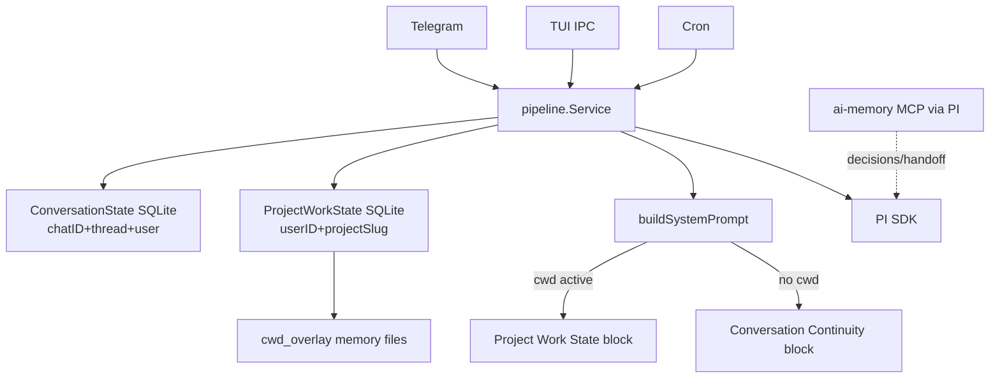

# Project Work State — Design

**Spec:** `.specs/features/project-work-state/spec.md`
**Status:** Draft

---

## Architecture



Continuity por chat **não desaparece** — alimenta debug, `/status`, e chat mode. Com `/cwd`, o prompt **prioriza** `ProjectWorkState`.

---

## Package Layout

### Opção escolhida: extender `internal/continuity`

Mesmo domínio (recovery context), mesmo DB file, nova tabela. Evita segundo store e migration complexity.

```
internal/continuity/
├── types.go              # + ProjectWorkKey, ProjectWorkState, caps
├── store.go              # + GetProjectWork, PatchProjectWork
├── store_sqlite.go       # + table project_work_state, migration
├── format.go             # + FormatProjectWorkSection
├── project_work_test.go  # new
└── ...existing...
```

Alternativa rejeitada: `internal/workstate/` separado — over-engineering para uma tabela e dois métodos.

---

## SQLite Schema

```sql
CREATE TABLE IF NOT EXISTS project_work_state (
    user_id          INTEGER NOT NULL,
    project_slug     TEXT NOT NULL,
    cwd              TEXT NOT NULL DEFAULT '',
    active_goal      TEXT NOT NULL DEFAULT '',
    last_user_intent TEXT NOT NULL DEFAULT '',
    last_assistant_summary TEXT NOT NULL DEFAULT '',
    last_checkpoint  TEXT NOT NULL DEFAULT '',
    last_run_id      TEXT NOT NULL DEFAULT '',
    last_run_status  TEXT NOT NULL DEFAULT '',
    last_tools       TEXT NOT NULL DEFAULT '',
    last_entrypoint  TEXT NOT NULL DEFAULT '',
    last_chat_id     INTEGER NOT NULL DEFAULT 0,
    updated_at       TEXT NOT NULL,
    PRIMARY KEY (user_id, project_slug)
);
```

Migration: `continuity/store_sqlite.go` `ensureSchema` append-only (padrão existente).

---

## Store Interface

```go
type ProjectWorkKey struct {
    UserID       int64
    ProjectSlug  string
}

type ProjectWorkState struct {
    UserID       int64
    ProjectSlug  string
    CWD          string
    ActiveGoal           string
    LastUserIntent       string
    LastAssistantSummary string
    LastCheckpoint       string
    LastRunID            string
    LastRunStatus        string
    LastTools            string
    LastEntrypoint       string
    LastChatID           int64
    UpdatedAt            time.Time
}

type ProjectWorkPatch struct {
    CWD                  *string
    ActiveGoal           *string
    LastUserIntent       *string
    LastAssistantSummary *string
    LastCheckpoint       *string
    LastRunID            *string
    LastRunStatus        *string
    LastTools            *string
    LastEntrypoint       *string
    LastChatID           *int64
    UpdatedAt            time.Time
}

// On Store interface:
GetProjectWork(ctx, userID, projectSlug) (*ProjectWorkState, error)
PatchProjectWork(ctx, ProjectWorkKey, ProjectWorkPatch) error
```

Reutilizar `sanitize()` e caps de `types.go` (exportar ou duplicar constantes com alias).

---

## Pipeline Changes

### 1. `pipeline.Config`

```go
type Config struct {
    // ...
    EntryPoint string // "telegram" | "tui" | "cron" — default "telegram"
}
```

Wire:
- `cmd/aurelia/app.go` (Telegram bot): `EntryPoint: observability.EntryPointTelegram`
- `cmd/aurelia/tui_handler.go`: `EntryPoint: observability.EntryPointTUI`
- `internal/cron/runtime.go`: `EntryPoint: observability.EntryPointCron`

### 2. `turn_lifecycle.go`

Nova função `patchProjectWorkAfterTurn(...)` chamada no final de success/failure/cold paths:

```go
func (s *Service) mirrorProjectWork(ctx context.Context, chatID int64, threadID int, userID int64, patch continuity.ProjectWorkPatch) {
    cwd := s.effectiveCwd(nil, chatID, threadID)
    if cwd == "" || s.continuity == nil || s.resolver == nil {
        return
    }
    slug := runtime.ProjectSlug(cwd)
    if slug == "" {
        return
    }
    ep := s.entryPoint // from Config, default telegram
    patch.LastEntrypoint = &ep
    patch.LastChatID = &chatID
    _ = s.continuity.PatchProjectWork(ctx, continuity.ProjectWorkKey{UserID: userID, ProjectSlug: slug}, patch)
}
```

Extrair campos comuns de `patchContinuityAfterSuccess` para evitar drift (helper `buildTurnPatch(...)`).

### 3. `prompt_builder.go`

```go
func (bc *Service) buildContinuitySection(...) string {
    cwd := bc.effectiveCwdForContext(...)
    if cwd != "" {
        return bc.buildProjectWorkSection(cwd, userText, userID, bc.entryPoint)
    }
    // existing chat continuity logic
}

func (bc *Service) buildProjectWorkSection(cwd, userText string, userID int64, entrypoint string) string {
    slug := runtime.ProjectSlug(cwd)
    state, err := bc.continuity.GetProjectWork(ctx, userID, slug)
    // freshness: cross-surface always inject; same as continuity FreshnessHot rules
    return continuity.FormatProjectWorkSection(state, RedactSecrets)
}
```

### 4. `buildSurfaceInstructions` (P0)

```go
func (bc *Service) buildSurfaceInstructions(entrypoint string, chatID int64, ...) string {
    switch entrypoint {
    case observability.EntryPointTUI:
        return bc.buildTUIInstructions(...)
    default:
        return bc.buildTelegramInstructions(...)
    }
}
```

TUI block (~400 chars): cwd, chatID local, “terminal surface — no Telegram reactions”, file tools rules iguais.

### 5. `startRunLog`

```go
ep := s.entryPoint
if ep == "" {
    ep = observability.EntryPointTelegram
}
EntryPoint: ep,
```

Add to `internal/observability/context.go`:
```go
EntryPointTUI = "tui"
```

---

## Format & Security

`FormatProjectWorkSection` mirrors `FormatContinuitySection`:
- `RedactSecrets` on all text fields
- `EscapeUntrusted` for delimiter safety
- `capString` with same limits
- Wrapper `<project_work_state_untrusted>`
- Max block: `MaxProjectWorkBlockChars = 2000` (same as continuity)

**Do not inject** `LastChatID` into prompt (internal metadata only).

---

## Testing Plan

| Test | Package |
|---|---|
| SQLite CRUD + patch merge | `continuity/project_work_test.go` |
| Format redaction + caps | `continuity/format_test.go` |
| Prompt: cwd → project block, no chat block | `pipeline/prompt_builder_test.go` |
| Prompt: no cwd → chat block only | `pipeline/prompt_builder_test.go` |
| Cross-surface inject when entrypoint differs | `pipeline/prompt_builder_test.go` |
| TUI prompt lacks telegram react | `pipeline/prompt_builder_test.go` |
| mirrorProjectWork called on success | `pipeline/turn_lifecycle_test.go` |
| Dual-write isolation user A/B | `continuity/project_work_test.go` |

---

## Rollout

1. Schema migration on daemon start (automatic via `ensureSchema`)
2. No backfill required — state populates on first turn with `/cwd` after deploy
3. Optional: one-time copy latest `ConversationState` → `ProjectWorkState` per binding (nice-to-have, **not MVP**)

---

## Future (out of this spec)

- Nudge auto-extract `ActiveGoal` → `ProjectWorkPatch` (P2)
- `/handoff` command delegating to ai-memory (P2)
- `ContextBudgetReport` logging which block was injected (continuity spec open item)